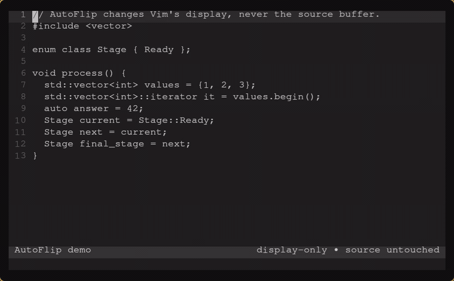

# vim-autoflip

AutoFlip is a display-only C++ type viewer for current Vim 9.x. It has two
modes:

- `prefer-auto` displays a safe `auto` spelling over an explicit local-variable
  type. Its default level uses clang-tidy `modernize-use-auto`; opt-in levels
  also accept increasingly broad clangd AST-proven local declarations.
- `show-deduced-types` displays clangd's inferred type over the source `auto`
  spelling.

AutoFlip never applies an edit. The buffer, undo history, saved file, search,
yanks, macros, navigation, and Git diff continue to use the original source.
Only Vim conceal matches and virtual text change what a window displays.

## Demo

This real Vim/vim-lsp/clangd session shows a clang-tidy iterator replacement,
AST-proven copy replacements, selective cursor reveal, `show-deduced-types`,
and the untouched source returning on disable:



## Use cases

Every AutoFlip view below is display-only; the source remains exactly as
shown in its source block.

### Conservative `prefer-auto`

Authority: clang-tidy `modernize-use-auto`, delivered by clangd.

Source:

```cpp
std::vector<int>::iterator it = values.begin();
```

AutoFlip view:

```cpp
auto it = values.begin();
```

### Aggressive `prefer-auto`

Authority: additional structured-AST proof from clangd.

Source:

```cpp
Stage next = current;
```

AutoFlip view:

```cpp
auto next = current;
```

### Show the deduced type

Authority: clangd's deduced-type inlay hint.

Source:

```cpp
auto answer = 42;
```

AutoFlip view:

```cpp
int answer = 42;
```

The package/repository name is `vim-autoflip`; its Vim command and display
prefix is `AutoFlip`, and its Vim9script/global namespace is `autoflip`. This
is a deliberate breaking identity with no compatibility aliases. Remove an
earlier installed copy, update the plugin-manager path and configuration names,
restart Vim, and regenerate help tags after upgrading.

## Requirements

- current Vim 9.x with `+vim9script`, `+textprop`, `+conceal`, `+channel`, and
  `+job`;
- [vim-lsp](https://github.com/prabirshrestha/vim-lsp), loaded as a required
  dependency;
- clangd attached to the C++ buffer through vim-lsp;
- an accurate `compile_commands.json` (or equivalent clangd configuration);
- clang-tidy's `modernize-use-auto` enabled for `prefer-auto`;
- clangd deduced-type inlay hints enabled for `show-deduced-types`.

Neovim, legacy Vim, Coc, direct clangd process management, and heuristic type
deduction are intentionally unsupported.

## Installation

With vim-plug, load vim-lsp before AutoFlip:

```vim
Plug 'prabirshrestha/vim-lsp'
Plug 'xpac27/vim-autoflip'
```

Or copy/clone this repository below a Vim package `start` directory. Run
`:helptags ALL` after installation.

A minimal vim-lsp clangd registration is:

```vim
if executable('clangd')
  au User lsp_setup call lsp#register_server({
        \ 'name': 'clangd',
        \ 'cmd': {server_info -> ['clangd', '--background-index', '--clang-tidy']},
        \ 'allowlist': ['c', 'cpp', 'objc', 'objcpp'],
        \ })
endif
```

`vim-lsp-settings` may register clangd instead. Keep `clangd` in the registered
server name so AutoFlip can conservatively identify it. AutoFlip makes its own
raw inlay-hint request; vim-lsp's renderer can remain disabled (its default):

```vim
let g:lsp_inlay_hints_enabled = 0
```

clang-tidy also publishes `modernize-use-auto` diagnostics that vim-lsp may
show beside AutoFlip's replacement. To hide this redundant text, disable all
diagnostic virtual text before vim-lsp loads; signs, highlights, diagnostic
lists, and AutoFlip continue to work:

```vim
let g:lsp_diagnostics_virtual_text_enabled = 0
```

In the project root, enable the clang-tidy check and deduced-type hints:

```yaml
# .clangd
Diagnostics:
  ClangTidy:
    Add: [modernize-use-auto]
InlayHints:
  DeducedTypes: Yes
```

Some clangd installations enable clang-tidy without the launch flag; using
`--clang-tidy` explicitly is the clearest known-good setup. AutoFlip does not
invent compiler flags. Fix compilation database problems in the project.

## Usage

AutoFlip is opt-in. Open a supported C++ file and run:

```vim
:AutoFlipEnable
:AutoFlipMode prefer-auto
:AutoFlipPreferAutoLevel same-type-copies
:AutoFlipPreferAutoLevel ast-proven-locals
:AutoFlipMode show-deduced-types
:AutoFlipRefresh
:AutoFlipReveal
:AutoFlipStatus
:AutoFlipDisable
```

`:AutoFlipToggle` switches the current buffer on or off. Insert mode reveals
the original spelling by default. Moving onto a concealed type keeps its
original spelling visible until the cursor leaves that source range; every
other substitution remains concealed. No mappings are installed; an optional
user mapping is:

```vim
nnoremap <leader>av <Cmd>AutoFlipToggle<CR>
```

## Configuration

Set globals before the plugin loads:

```vim
let g:autoflip_enabled_by_default = v:false
let g:autoflip_mode = 'prefer-auto'
let g:autoflip_debounce_ms = 300
let g:autoflip_reveal_on_insert = v:true
let g:autoflip_reveal_under_cursor = v:true
let g:autoflip_max_visible_lines = 300
let g:autoflip_type_name_limit = 80
let g:autoflip_prefer_auto_level = 'conservative'
let g:autoflip_max_ast_requests = 40
```

`g:autoflip_type_name_limit` is fail-closed: a longer clangd label is skipped,
not cut into a potentially misleading C++ type.

`g:autoflip_max_visible_lines` also bounds the synchronous lexical preflight
for AST-backed prefer-auto levels. clangd requests themselves remain
asynchronous.

After an edit, views on byte-identical source lines remain rendered while the
debounced request is pending. Views on edited or shifted lines are removed
immediately and clangd's accepted reply remains authoritative.

Diagnostic updates queue a follow-up refresh without invalidating the
code-action or AST reply already in flight.

`g:autoflip_prefer_auto_level` selects one of three policies:

- `conservative` (default) renders only direct clang-tidy
  `modernize-use-auto` code actions.
- `same-type-copies` includes the conservative results and additionally
  requests clangd AST nodes for simple local `Type copy = original;`
  declarations. It renders only when clangd reports a plain variable, the
  exact type range, and an initializer whose only implicit operation is
  `LValueToRValue`.
- `ast-proven-locals` includes both preceding policies and also accepts:
  - `Type target = source;` when clangd reports direct copy construction with
    a single no-op conversion of `source`;
  - `Type& target = object[index];` when clangd reports an lvalue `operator[]`
    expression; and
  - `Type* target = source;` when clangd reports a direct pointer-variable
    read.
  - `Type target = call(...);` and `const Type target = call(...);` when
    clangd reports an unwrapped direct call result, rendered as `auto` and
    `const auto` respectively.
  - The same call-result form split over one adjacent continuation line:
    `Type target =` followed by `call(...);`.

For example, the stronger level can display both declarations as `auto`:

```cpp
State c = a;
Transition d = b;
```

Use `:AutoFlipPreferAutoLevel conservative`,
`:AutoFlipPreferAutoLevel same-type-copies`, or
`:AutoFlipPreferAutoLevel ast-proven-locals` to switch at runtime. The AST
levels use at most `g:autoflip_max_ast_requests` requests per refresh; zero
disables their additional candidates while preserving clang-tidy results.

## Troubleshooting

Start with `:AutoFlipStatus`.

- `vim-lsp is not installed`: install/load vim-lsp before AutoFlip.
- `no running clangd server is attached`: check vim-lsp registration and
  `:LspStatus`/`:CheckHealth` if available.
- `does not advertise code actions`: update/configure clangd and vim-lsp.
- `does not advertise inlay hints`: use a current clangd with standard
  `inlayHintProvider` support.
- `does not advertise AST support`: `same-type-copies` needs a clangd version
  that advertises its `astProvider` protocol extension; use `conservative` if
  the installed server lacks it.
- `0 substitutions`: inspect clangd diagnostics, `.clangd`, the compilation
  database, and the conservative limitations below. This is not an error.
- duplicated inlay hints: disable vim-lsp's renderer with
  `g:lsp_inlay_hints_enabled = 0`.

For vim-lsp protocol logs:

```vim
let g:lsp_log_verbose = 1
let g:lsp_log_file = '/tmp/vim-lsp.log'
```

## Intentional limitations

- Only `.cc`, `.cpp`, `.cxx`, `.h`, `.hh`, `.hpp`, and `.hxx` C++ files and
  simple initialized local variables are targeted.
- Conservative `prefer-auto` accepts direct, single-edit `WorkspaceEdit` code
  actions only. Command-backed or multi-file fixes are ignored.
- `same-type-copies` intentionally recognizes only one-line, single-declarator
  `Type target = source;` locals without cv/ref/pointer spelling. Qualifiers,
  references, calls, constructors, casts, conversions, macros, and ambiguous
  AST shapes are skipped.
- `ast-proven-locals` additionally recognizes only single `&` or `*`
  declarators without cv qualifiers, plus non-cv or top-level `const` value
  declarations initialized by direct calls. It accepts only the exact AST
  shapes documented above, with at most one adjacent call-only continuation
  line; rvalue references, null pointers, conversion-wrapped calls, casts,
  conversions, multi-declarators, macros, and ambiguous AST nodes are skipped.
- `show-deduced-types` currently accepts simple `auto name = ...`
  declarations. Direct-list initialization, function returns, parameters,
  fields, aliases, structured bindings, macros, and ambiguous declarations are
  ignored.
- Cursor reveal removes only the selected TypeView, but that selection appears
  as source in every split showing the buffer because virtual text is
  buffer-owned. Insert and explicit command reveal intentionally expose all
  types. Conceal matches and option restoration remain independently tracked
  for each window.
- Lazy-loading the AutoFlip runtime itself after clangd has already published
  diagnostics can omit clang-tidy candidates until clangd publishes again.
  Normal startup loading, including later manual enable, caches them safely.
- AutoFlip recognizes an attached server whose vim-lsp name or info name
  contains `clangd`.

## Public API

The supported user API is the `:AutoFlip...` command family, the nine
`g:autoflip_...` configuration variables above, and the `AutoFlipAuto` and
`AutoFlipDeducedType` highlight groups. The `b:autoflip_state` dictionary and
autoload module exports are implementation details and may change. Version 1
does not emit User autocommands or install mappings.

See `:help autoflip`, [features](docs/features.md), and
[architecture](docs/architecture.md) for the complete behavior.

## Development

Run all deterministic checks without a personal Vim configuration:

```sh
make check
```

The optional real-clangd test is described in `test/README.md`; it skips when
vim-lsp or clangd is unavailable.
